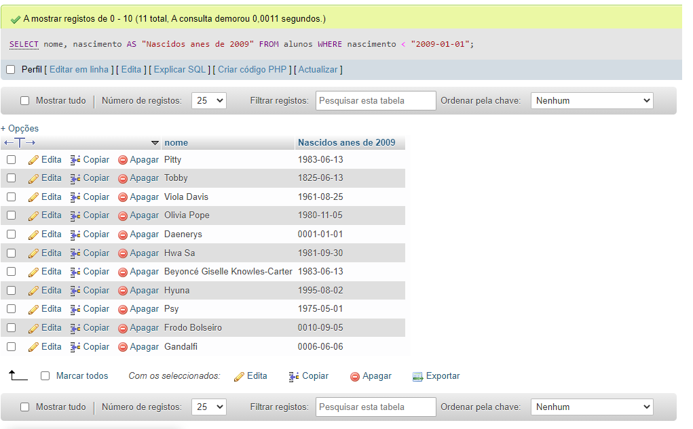
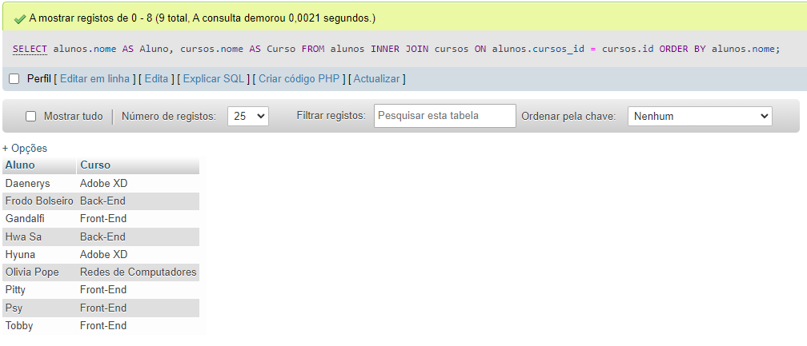

### Efetuando consultas ao banco de dados da Escola

# 1) Faça uma consulta que mostre os alunos que nasceram antes do ano 2009:

```sql
SELECT nome, nascimento AS "Nascidos anes de 2009" FROM alunos WHERE nascimento < "2009-01-01";
```

# 2) Faça uma consulta que calcule a média das notas de cada aluno e as mostre com duas casas decimais.

```sql
SELECT nome, nota1, nota2, ROUND(AVG(nota1+nota2)/2,2) AS "Médias das Notas" FROM alunos GROUP BY nome;
```

# 3) Faça uma consulta que calcule o limite de faltas de cada curso de acordo com a carga horária. Considere o limite como 25% da carga horária. Classifique em ordem crescente pelo título do curso.

```sql
SELECT nome, duracao, (duracao*0.25)/2 AS "Limite de aaltas do curso" FROM cursos ORDER BY nome;
```

# 4) Faça uma consulta que mostre os nomes somente dos professores da área de desenvolvimento.

```sql
SELECT nome, especialidade FROM professores WHERE especialidade = "Desenvolvimento";
```

# 5) Faça uma consulta que mostre a quantidade de professores por área de desenvolvimento.

```sql
SELECT especialidade, COUNT(especialidade) AS "Quantidade de professores em cada área" FROM professores GROUP BY especialidade;
```


# 6) Faça uma consulta que mostre o nome dos alunos, o título e a carga horária dos cursos que fazem.

```sql
SELECT alunos.nome AS Aluno, cursos.nome AS Curso, duracao AS "Carga horária" FROM alunos INNER JOIN cursos ON alunos.cursos_id = cursos.id;
```


# 7) Faça uma consulta que mostre o nome dos professores e o título do curso que lecionam. Classifique pelo nome do professor.

```sql
SELECT professores.nome AS Professor, cursos.nome AS "Curso Selecionado" FROM professores INNER JOIN cursos ON professores.curso_id = cursos.id ORDER BY professores.nome;
```


# 8) Faça uma consulta que mostre o nome dos alunos, o título dos cursos que fazem, e o professor de cada curso.

```sql
SELECT alunos.nome AS Aluno, cursos.nome AS Curso, professores.nome AS Professor FROM alunos INNER JOIN cursos ON alunos.cursos_id = cursos.id INNER JOIN professores ON professores.curso_id = cursos_id;
```


# 9) Faça uma consulta que mostre a quantidade de alunos que cada curso possui. Classifique os resultados em ordem descrecente de acordo com a quantidade de alunos.

```sql
SELECT cursos.nome, COUNT(alunos.cursos_id) FROM alunos INNER JOIN cursos on alunos.cursos_id = cursos.id GROUP BY cursos.id ORDER BY COUNT(alunos.cursos_id) DESC;
```


# 10) Faça uma consulta que mostre o nome dos alunos, suas notas, médias, e o título dos cursos que fazem. Devem ser considerados somente os alunos de Front-End e Back-End. Mostre classificados pelo nome do aluno.

```sql
SELECT alunos.nome AS Nome, nota1 AS "Nota 1", nota2 AS "Nota 2", (nota1+nota2)/2 AS "Médias das Notas", cursos.nome AS Curso FROM alunos INNER JOIN cursos On alunos.cursos_id = cursos.id WHERE alunos.cursos_id = 3 OR alunos.cursos_id = 4;
```


# 11)Faça uma consulta que altere o nome do curso de Figma para Adobe XD e sua carga horária de 10 para 15.

```sql
UPDATE cursos SET nome = 'Adobe XD' WHERE id = 6;
UPDATE cursos SET duracao = 15 WHERE id = 6;
```
# sem imagem

# 12) Faça uma consulta que exclua um aluno do curso de Redes de Computadores e um aluno do curso de UX/UI.

# 1° consultando os possiveis alunos 
```sql
SELECT alunos.nome AS Aluno, cursos.nome AS Curso FROM alunos INNER JOIN cursos ON alunos.cursos_id = cursos.id;
```
# 2° comando da exclusão
```sql
DELETE FROM alunos WHERE id = 3 OR id = 7; 
```


# 13) Faça uma consulta que mostre a lista de alunos atualizada e o título dos cursos que fazem, classificados pelo nome do aluno.

``` sql
SELECT alunos.nome AS Aluno, cursos.nome AS Curso FROM alunos INNER JOIN cursos ON alunos.cursos_id = cursos.id ORDER BY alunos.nome;
```


### Desafios

# 1.	Criar uma consulta que calcule a idade do aluno

```sql
SELECT nome AS Nome, nascimento AS "Data de Nascimento", nascimento AS "Data de Nascimento" TIMESTAMPDIFF(YEAR,nascimento, curdate()) AS Idade FROM alunos;
```


# 2.	Criar uma consulta que calcule a média das notas de cada aluno e mostre somente os alunos que tiveram a média maior ou igual a 7.
```SQL

SELECT alunos.nome AS Nome, nota1 AS "Nota 1", nota2 AS "Nota 2", ROUND(AVG(nota1+nota2)/2,2) AS "Médias das Notas" FROM alunos WHERE (nota1+nota2)/2 >=7 GROUP BY nome;
```


# 3.	Criar uma consulta que calcule a média das notas de cada aluno e mostre somente os alunos que tiveram a média menor que 7
```sql
SELECT alunos.nome AS Nome, nota1 AS "Nota 1", nota2 AS "Nota 2", ROUND(AVG(nota1+nota2)/2,2) AS "Médias das Notas" FROM alunos WHERE (nota1+nota2)/2 < 7 GROUP BY nome;
```


# 4.	Criar uma consulta que mostre a quantidade de alunos com média maior ou igual a 7.
```sql
SELECT COUNT((nota1+nota2)/2) AS "Alunos com nota igual ou maior a 7" FROM alunos WHERE (nota1+nota2)/2 >=7;
```
![](consulta-desafio 